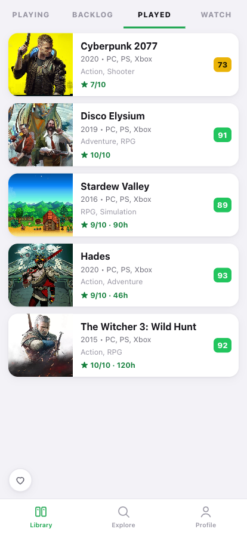

# GamesTable

A personal video game tracker: what you are playing now, what you want to finish,
what you have already finished, and what you would rather watch as a playthrough
or a game movie on YouTube and Twitch. The library is stored on the device; no
account required.

**Try it:** [web app](https://games-table-bay.vercel.app) (installs as a PWA on
Android, iPhone and desktop) | [iOS beta on TestFlight](https://testflight.apple.com/join/7XYcknae)



One codebase ships three ways: the PWA on the web, and iOS and Android shells via
Capacitor. The iOS shell adds a native home-screen widget (SwiftUI, WidgetKit) fed
from the web app through an App Group store. Shared UI and storage code lives in
[tables-core](https://github.com/mrWD/tables-core), the same package behind
[FilmTable](https://github.com/mrWD/film-table).

A free fan project. Not affiliated with RAWG, IGDB, Valve, YouTube or Twitch.

## Features

- **Two status tracks:** playing (want to play → playing → played) and watching
  (want to watch → watching → watched), plus "dropped".
- **Library** with PLAYING / BACKLOG / PLAYED / WATCH tabs; the watch tab is split
  into "watching", "want to watch" and "watched" sections and can be filtered by
  each of them.
- **Game page:** cover, year, platforms, genres, Metacritic score, your own 1–10
  rating, hours, a note, and the platform you played or watched it on.
- **"For you" recommendations** — computed on the device from your own library,
  and every card explains why it is there.
- **Watch links:** YouTube (longplay, game movie, walkthrough, review) and Twitch
  — one tap, no embedded players and no third-party tracking.
- **Profile:** statistics by status, platform and genre, backup export and import,
  a feedback form and contacts, and a way to support the project.
- **Hidden `/#/insights` page** — usage counters for this device plus diagnostics:
  it shows which source is responding and whether the app is running on Steam
  alone.
- **Theme:** system, light or dark, remembered independently of the device.

## Data

| Source | What it provides | Key |
|---|---|---|
| [RAWG](https://rawg.io/apidocs) | all platforms, covers, ratings; the primary catalogue | free, required |
| [IGDB](https://api-docs.igdb.com/) | console games with cover art; the second catalogue | free, via a Twitch app; optional |
| Steam | PC games without a key; the fallback path | not required |

All three go through a thin serverless proxy: the RAWG key and the IGDB client
secret cannot live in the browser, and Steam does not send CORS headers at all.
Without IGDB credentials the proxy answers 503 and search moves on to the next
source. Details and measurements are in
[docs/DATA-SOURCES.md](docs/DATA-SOURCES.md).

## Running locally

```bash
npm install
npm run dev
```

Search only works with the proxy running, since none of the sources is reachable
from the browser directly:

```bash
echo 'RAWG_API_KEY=<key>' > .env.local            # the file is in .gitignore
echo 'IGDB_CLIENT_ID=<id>' >> .env.local           # optional, for console games
echo 'IGDB_CLIENT_SECRET=<secret>' >> .env.local
node --env-file=.env.local scripts/dev-api.mjs    # proxy on :3001
npm run dev                                       # Vite proxies /api to it
```

The native shells are built from the same source: `npm run build:native`, then
`npx cap sync` and open `ios/App` or `android/` in Xcode or Android Studio.
[docs/RELEASE-IOS.md](docs/RELEASE-IOS.md) covers the TestFlight upload.

## Documentation

| File | What it covers |
|---|---|
| [CLAUDE.md](CLAUDE.md) | brief context, principles, how to verify |
| [docs/PLAN.md](docs/PLAN.md) | the concept, statuses, screens |
| [docs/ARCHITECTURE.md](docs/ARCHITECTURE.md) | code structure and data model |
| [docs/DATA-SOURCES.md](docs/DATA-SOURCES.md) | the APIs and their quirks, with measurements |
| [docs/DECISIONS.md](docs/DECISIONS.md) | why it is built this way, and the pitfalls from FilmTable |
| [docs/DEPLOY.md](docs/DEPLOY.md) | deployment, environment variables, production checks |
| [docs/RELEASE-IOS.md](docs/RELEASE-IOS.md) | building the iOS shell and releasing to TestFlight |
| [docs/STORE.md](docs/STORE.md) | store listing draft and screenshots |
